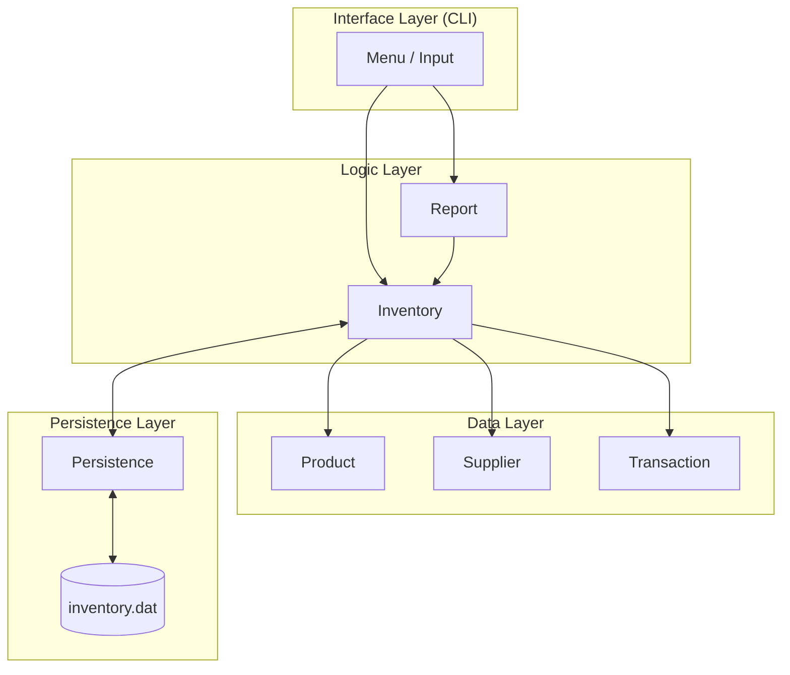

```mermaid
flowchart TB
    subgraph UI["Interface Layer (CLI)"]
        Menu[Menu / Input]
    end

    subgraph Logic["Logic Layer"]
        Inv[Inventory]
        Rep[Report]
    end

    subgraph Data["Data Layer"]
        Prod[Product]
        Sup[Supplier]
        Tx[Transaction]
    end

    subgraph Persist["Persistence Layer"]
        Pers[Persistence]
        File[(inventory.dat)]
    end

    Menu --> Inv
    Menu --> Rep
    Inv --> Prod
    Inv --> Sup
    Inv --> Tx
    Rep --> Inv
    Inv <--> Pers
    Pers <--> File
```