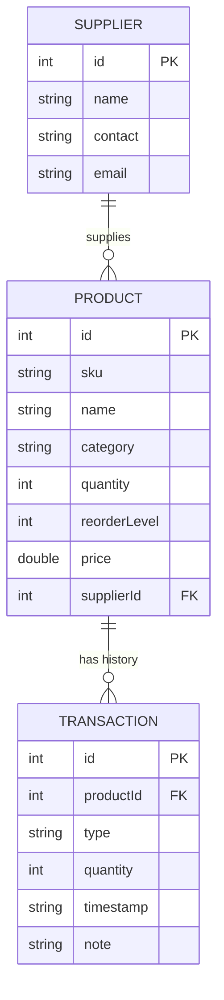

```mermaid
erDiagram
    SUPPLIER ||--o{ PRODUCT : supplies
    PRODUCT  ||--o{ TRANSACTION : "has history"

    SUPPLIER {
        int id PK
        string name
        string contact
        string email
    }
    PRODUCT {
        int id PK
        string sku
        string name
        string category
        int quantity
        int reorderLevel
        double price
        int supplierId FK
    }
    TRANSACTION {
        int id PK
        int productId FK
        string type
        int quantity
        string timestamp
        string note
    }
```