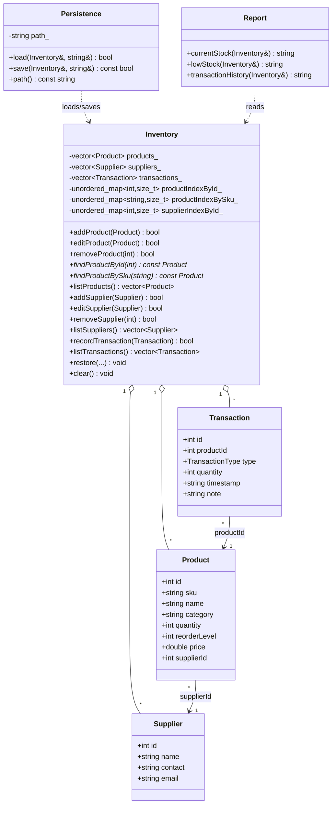

```mermaid
classDiagram
    class Inventory {
        -vector~Product~ products_
        -vector~Supplier~ suppliers_
        -vector~Transaction~ transactions_
        -unordered_map~int,size_t~ productIndexById_
        -unordered_map~string,size_t~ productIndexBySku_
        -unordered_map~int,size_t~ supplierIndexById_
        +addProduct(Product) bool
        +editProduct(Product) bool
        +removeProduct(int) bool
        +findProductById(int) const Product*
        +findProductBySku(string) const Product*
        +listProducts() vector~Product~
        +addSupplier(Supplier) bool
        +editSupplier(Supplier) bool
        +removeSupplier(int) bool
        +listSuppliers() vector~Supplier~
        +recordTransaction(Transaction) bool
        +listTransactions() vector~Transaction~
        +restore(...) void
        +clear() void
    }

    class Persistence {
        -string path_
        +load(Inventory&, string&) bool
        +save(Inventory&, string&) const bool
        +path() const string
    }

    class Report {
        +currentStock(Inventory&) string
        +lowStock(Inventory&) string
        +transactionHistory(Inventory&) string
    }

    class Product {
        +int id
        +string sku
        +string name
        +string category
        +int quantity
        +int reorderLevel
        +double price
        +int supplierId
    }

    class Supplier {
        +int id
        +string name
        +string contact
        +string email
    }

    class Transaction {
        +int id
        +int productId
        +TransactionType type
        +int quantity
        +string timestamp
        +string note
    }

    Inventory "1" o-- "*" Product
    Inventory "1" o-- "*" Supplier
    Inventory "1" o-- "*" Transaction
    Persistence ..> Inventory : loads/saves
    Report ..> Inventory : reads
    Product "*" --> "1" Supplier : supplierId
    Transaction "*" --> "1" Product : productId
```